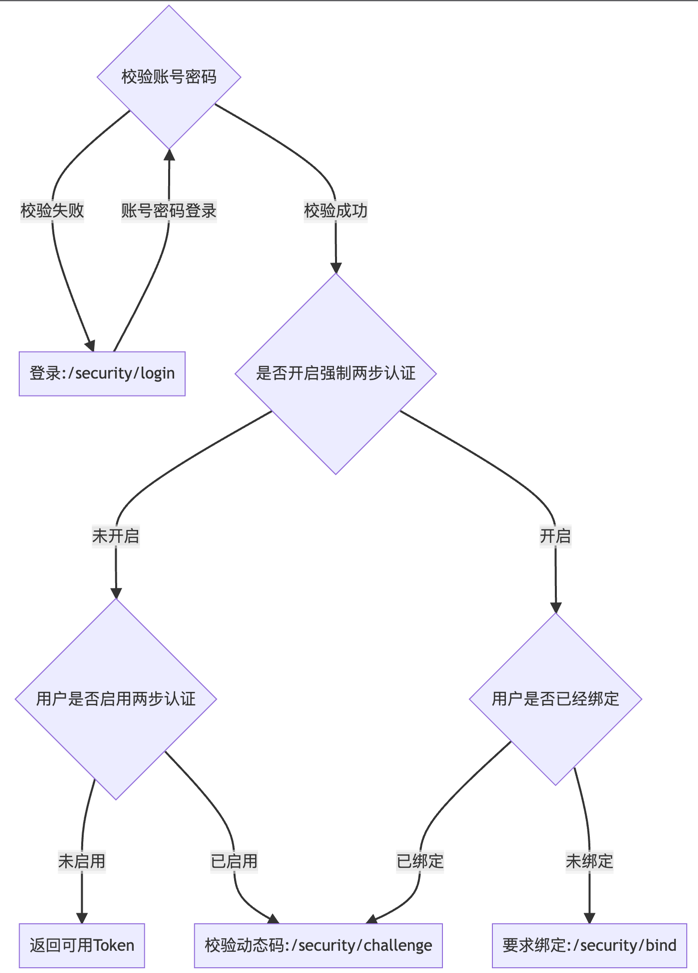

# SpringBoot App Common

## Swagger
项目集成了 swagger，并增加了一段javascript，实现了刷新页面时，token 还保存着。

注意事项：
- 地址为 `/swagger-ui/`
- 默认仅允许 `127.0.0.1` 访问
- 默认启用状态为  `false`

配置示例
```yaml
# ===== 自定义swagger配置 ===== #
swagger:
  enable: true
  application-name: IF3000 Manage Platform
  application-version: 0.0.1
  group-name: ${swagger.application-name}
  application-description: ${swagger.application-name}
  contact:
    name: taills
    email: taills@qq.com
    url: https://github.com/taills/
```

### 在使用 SpringBoot 2.6 时，使用 Swagger 3.0.0 会报异常

参考信息 https://stackoverflow.com/questions/70036953/springboot-2-6-0-spring-fox-3-failed-to-start-bean-documentationpluginsboot

解决办法是暂时配置一个参数

```yaml
spring:
  mvc:
    pathmatch:
      matching-strategy: ant_path_matcher
```

## IP 访问控制列表 (黑白名单实现)
参考 nginx 配置指令，使用了 `ALLOW` 和 `DENY` 两种类型的记录

遵循：
- allow 类型的放行
- deny 类型的禁止
- 若IP地址同时存在于 allow 和 deny 中，则按 allow 处理

参考 [SecurityIpAclServiceTest.java](blob/main/src/test/java/io/github/taills/common/jpa/service/SecurityIpAclServiceTest.java)

## JPA

JPA 集成组件，配合代码生成脚本，自动化生成数据库访问层，非常便于使用与扩展。


## 建表要求

建表时要求必带如下`4`个字段

- id `bigint unsigned auto_increment`
- gmt_create `datetime default CURRENT_TIMESTAMP comment '创建时间'`
- gmt_modify `datetime default CURRENT_TIMESTAMP on update CURRENT_TIMESTAMP comment '修改时间',`
- is_deleted `boolean  default false comment '软删除标记'`

### User 表示例

```sql
create table user
(
    id           bigint unsigned auto_increment,
    user_id      varchar(20) CHARACTER SET utf8mb4 COLLATE utf8mb4_unicode_ci not null comment '用户ID',
    username     varchar(40) CHARACTER SET utf8mb4 COLLATE utf8mb4_unicode_ci not null comment '用户名',
    nickname     varchar(40) CHARACTER SET utf8mb4 COLLATE utf8mb4_unicode_ci not null comment '昵称',
    mobile       varchar(12) CHARACTER SET utf8mb4 COLLATE utf8mb4_unicode_ci not null comment '手机号',
    avatar_url   varchar(12) CHARACTER SET utf8mb4 COLLATE utf8mb4_unicode_ci not null comment '头像 URL',
    address_id   varchar(20) CHARACTER SET utf8mb4 COLLATE utf8mb4_unicode_ci not null comment '默认地址ID',
    gmt_create   datetime default CURRENT_TIMESTAMP comment '创建时间',
    gmt_modified datetime default CURRENT_TIMESTAMP on update CURRENT_TIMESTAMP comment '修改时间',
    is_deleted   boolean  default false comment '是否删除',
    primary key (id),
    index user_id_ (user_id, is_deleted),
    index username (username, is_deleted)
) ENGINE = InnoDB
  DEFAULT CHARSET = utf8mb4
    comment '用户基础表';
```
### 代码生成脚本

生成代码时选择包路径为 `io.github.taills.jpa`

成功会生成`4` 个文件夹 `controller` `entity` `repository` `service`


### 新增 deleteByUserId 方法
由于 UserId 为混乱的字符串,默认生成的代码里没有已该字段为条件删除表记录的，所以需要新增。

在 `UserRepository` 中新增以下内容，idea 中有插件的话，会有代码提示，包括字段名、排序等

```java
    @Modifying
    @Transactional
    Integer deleteAllByUserId(String userId);
```

在 `UserService` 中新增以下内容

```java
	public Integer deleteAllByUserId(String userId){
		return rep.deleteAllByUserId(userId);
	}
```

`Controller` 中新增以下内容

```java
    @DeleteMapping("/user/{userId}")
    public Integer delete(@PathVariable String userId) {
        return userService.deleteAllByUserId(userId);
    }
```


## Security 模块

预置基础的用户、用户组、角色功能，默认提供用户登录和管理员注册两个公开方形的端点。

### 拦截器规则
```java
        httpSecurity.csrf().disable()
        // dont authenticate this particular request
        .authorizeRequests()
        .antMatchers("/public/**").permitAll()
        // allow swagger ui
        .antMatchers("/swagger-ui/**",
        "/webjars/**",
        "/swagger-resources/**",
        "/v3/api-docs/**",
        "/installer/**"
        ).hasIpAddress("127.0.0.1")
        .antMatchers("/**/login").permitAll()
        .antMatchers("/**/register").permitAll()
        .anyRequest().authenticated().and()
        .exceptionHandling().authenticationEntryPoint(jwtAuthenticationEntrance).and().sessionManagement()
        .sessionCreationPolicy(SessionCreationPolicy.STATELESS);
```

## 两步认证 (2FA)

#### 两步认证配置说明
- `mandatory-two-step-authentication` 强制启用 ，开启后，用户必须绑定才能登录使用，未开启时，用户可自愿绑定启用两步认证功能。
- `two-setp-issuer` 会展示在xx验证器上面的名字
```yaml
common:
  security:
    mandatory-two-step-authentication: true
    two-setp-issuer: 产品名称
```

在生成两步认证密钥时，会碰到随机数熵池干了的情况，可使用以下java运行参数解决。

```shell
java -Djava.security.egd=file:/dev/./urandom -jar xxx.jar
```

#### 两步认证流程说明
```markdown
graph TD
B{校验账号密码}
B ---> |校验失败| A[登录:/security/login]
A ---> |账号密码登录| B
B ---> |校验成功| C{是否开启强制两步认证}
C ---> |未开启| D{用户是否启用两步认证}
D ---> |未启用| D1[返回可用Token]
D ---> |已启用| G
C ---> |开启| E{用户是否已经绑定}
E ---> |未绑定| F[要求绑定:/security/bind]
E ---> |已绑定| G[校验动态码:/security/challenge]
```



## 限流器

默认限流器的实现使用了Guava的 RateLimiter，适合单实例内限流。

若需要分布式，请实现 Limiter 接口并塞入 SpringBoot 容器中即可，默认的限流器将不会实例化。

详情请看代码。

## JTI 黑名单

默认实现了一个简单的内存版JTI黑名单，仅适合单实例，想要分布式，跟限流器一样，自行实现 JtiService 接口。


## 异常错误管理

统一异常错误代码+描述管理，在项目 resources 文件夹中，新建文件，名如 `exception_xxxxx.properties`,内容如：

```properties
1001=用户名或密码错误
1002=数据库不为空，不能再注册管理员账号
```

需要抛出异常时，操作为

```java
    throw ExceptionManager.create(1001);
```

